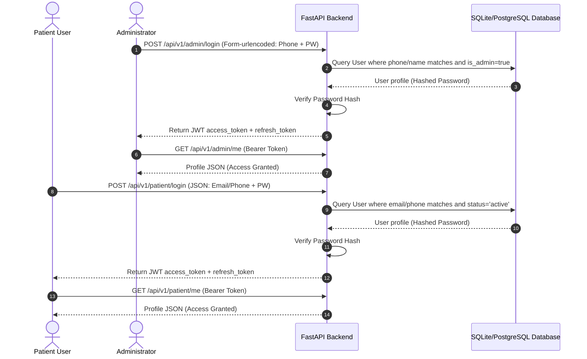
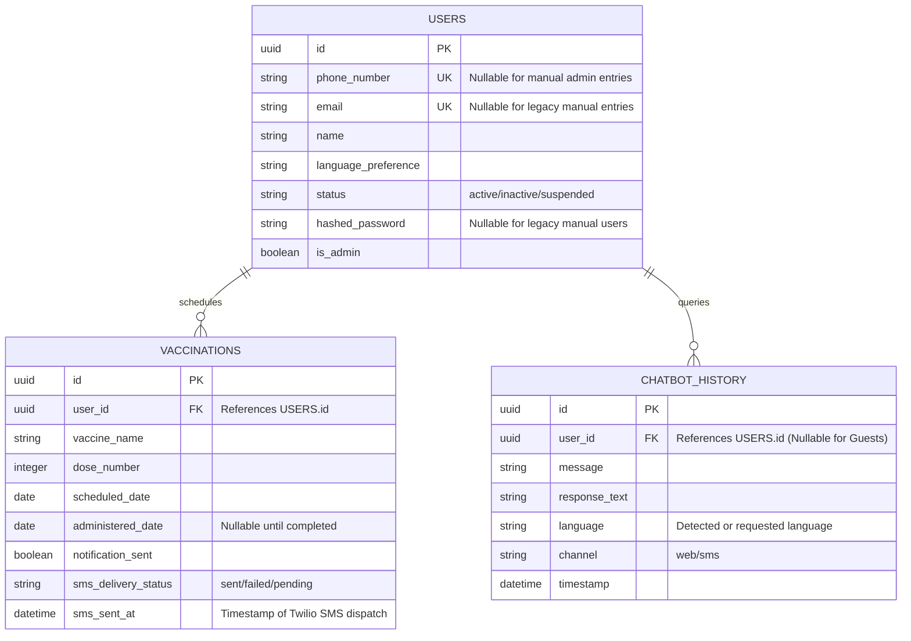
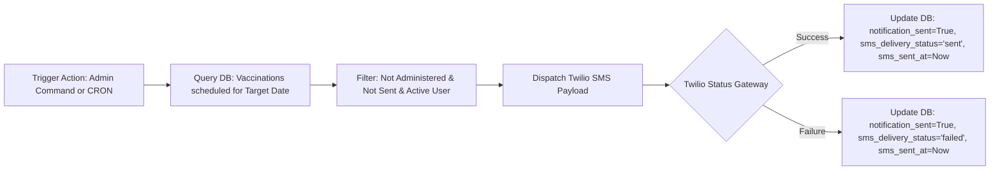

# HealthGuard AI - Phase 2 System Architecture

This document details the system design, authentication workflow, scheduling notification engine, and database entity relationships for the HealthGuard AI Public Health & Vaccination Platform.

---

## 1. System Components Diagram

The application uses a modern decoupled architecture separating the single-page application (React/Vite) from the web services API layer (FastAPI/SQLAlchemy).

```mermaid
graph TD
    subgraph Client Layer
        Landing[Public Landing Page]
        Login[Unified Login Page]
        Signup[Patient Signup Page]
        AdminConsole[Admin Dashboard / Console]
        PatientPortal[Patient Portal / Dashboard]
    end

    subgraph API Gateway & Service Layer (FastAPI)
        AuthRouter[Authentication & JWT Router]
        AdminRouter[Admin Aggregated Analytics Router]
        PatientRouter[Patient Profile & PDF Docs Router]
        ChatRouter[Chatbot Router - HuggingFace/T5]
        VaccRouter[Vaccination Schedule Router]
    end

    subgraph Messaging & Delivery Layer
        TwilioClient[Twilio SMS / Mock Engine]
    end

    subgraph Database Layer
        DB[(PostgreSQL / SQLite)]
    end

    %% Client Interactions
    Landing -->|Route| Login
    Landing -->|Route| Signup
    Login -->|JWT Exchange| AuthRouter
    Signup -->|Insert Patient| PatientRouter
    AdminConsole -->|Aggregated Metrics| AdminRouter
    AdminConsole -->|CRUD Schedules| VaccRouter
    PatientPortal -->|Stream ReportLab PDF| PatientRouter
    PatientPortal -->|Check Doses| PatientRouter
    PatientPortal -->|Ask AI| ChatRouter
    AdminConsole -->|Ask AI| ChatRouter

    %% Backend Dependencies
    AuthRouter -->|SQLAlchemy ORM| DB
    AdminRouter -->|SQLAlchemy ORM| DB
    PatientRouter -->|SQLAlchemy ORM| DB
    VaccRouter -->|SQLAlchemy ORM| DB
    VaccRouter -->|SMS Reminders| TwilioClient
    DB -->|Migrated via| Alembic
```

---

## 2. Authentication Flow

HealthGuard AI features two separate onboarding streams mapped under a single authentication middleware signature.



### Access Control Highlights
1. **Admin Routes** (`/admin/*`): Intercepted by `ProtectedRoute` in the React client requiring `isAdmin === true`. API requests verified via `get_current_admin_user` dependency.
2. **Patient Routes** (`/patient/*`): Intercepted by `ProtectedRoute` requiring `isAdmin === false`. API requests verified via `get_current_patient_user` dependency.
3. **Session Expiry**: Interceptors check for HTTP `401 Unauthorized` responses and clear local authentication storage immediately, routing the agent/member back to the Login view with a session expiry notification.

---

## 3. Database Schema ERD

Database tables mapped using `SQLAlchemy` declarative models and migrated via `Alembic` revisions.



---

## 4. Twilio SMS Notification Pathway

The SMS Engine delivers proactive care logs to patient mobiles safely without double-triggering reminders.



---

## 5. Development and Deployment Setup

- **Backend Dev Server**: FastAPI with Uvicorn (`py -m uvicorn app.main:app --reload`)
- **Frontend Dev Server**: Vite Dev Server (`npm run dev`)
- **Database Engine**: PostgreSQL for production deployments, SQLite with batch alters for local testing.
- **Client Bundling**: Vite building minified ESM components (`npm run build`)
