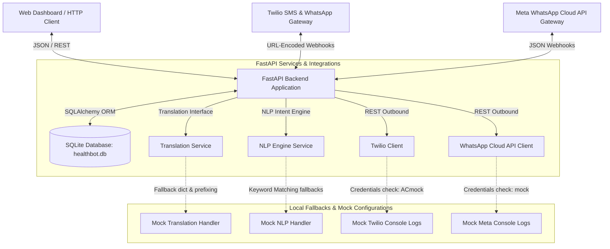
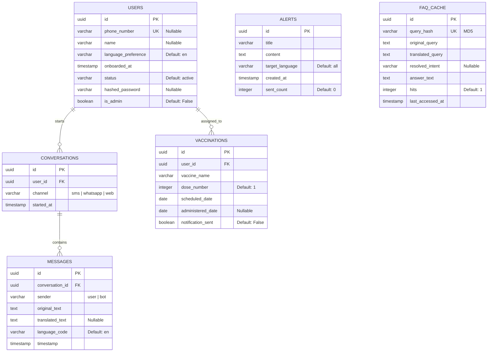
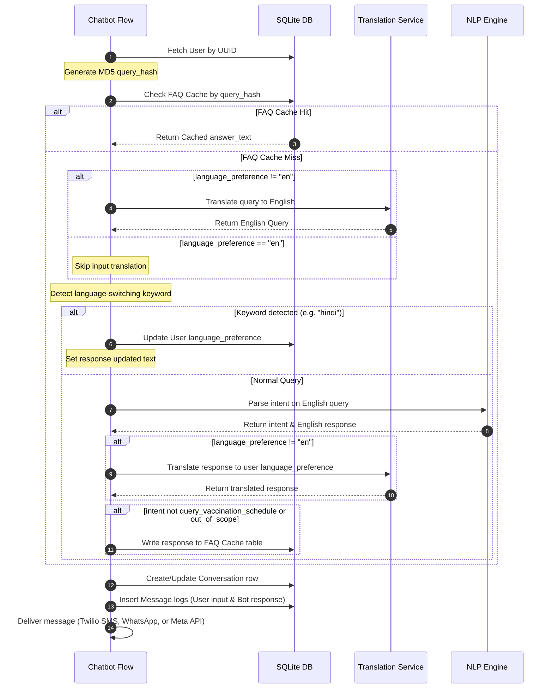

# FastAPI Backend Technical Documentation

This document provides the technical architecture, database schemas, processing workflows, security mechanisms, and API contracts for the **Public Health Chatbot & Vaccination Reminder Backend**, strictly mapped to the existing FastAPI python implementation.

---

## 1. System Architecture

The backend is built as an asynchronous FastAPI web application. It handles administrative console requests, public web chatbot queries, and incoming webhook triggers from Twilio (SMS/WhatsApp) and Meta WhatsApp Cloud API.

### 1.1 High-Level Component Flow



### 1.2 Asynchronous Webhook vs. Synchronous Chat Flow

The backend handles chatbot requests through two distinct request pipelines:

1. **Asynchronous Webhook Path (Twilio SMS/WhatsApp / Meta Webhook)**:
   * Webhook requests receive and parse user messages immediately.
   * To prevent HTTP connection timeouts from webhook gateways, FastAPI spawns a `BackgroundTasks` thread to process the chatbot flow (`process_chatbot_flow`) and returns a blank `200 OK` response instantly.
   * The response text is generated in the background task and dispatched asynchronously using the respective SMS/WhatsApp client APIs.
   
2. **Synchronous Web Chat Path (Web Widget)**:
   * Requests sent to `/api/v1/chatbot/query` are handled synchronously.
   * The request blocks until the translation, NLP inference, database persistence, and caching steps are completed.
   * The backend returns the final response body directly in the HTTP response payload.

### 1.3 Built-in Local Fallbacks

To operate in disconnected or local development mode, the services utilize adaptive mock fallbacks:
*   **NLP Intent Engine**: Queries Rasa if `RASA_URL` settings do not match `http://localhost` (or a mock/placeholder). Otherwise, it falls back to a rule-based **keyword-matching system** mapping common healthcare phrases (such as `booster`, `polio`, `tomorrow`, `schedule`, `hello`, `thanks`) to predefined intents and responses.
*   **Translation Service**: Communicates with the translation server if `TRANSLATION_API_URL` is active. Otherwise, it checks a local lookup dictionary `MOCK_TRANSLATIONS` containing static mappings for English $\leftrightarrow$ Hindi, falling back to a bracketed prefix format (`[TARGET_LANG translation of: text]`) for unknown inputs.
*   **Twilio Client**: Instantiated when `TWILIO_ACCOUNT_SID` does not start with `"ACmock"`. If it starts with `"ACmock"`, it logs all outbound SMS and WhatsApp message payloads directly to the application console output.
*   **Meta WhatsApp Client**: Instantiated when `WHATSAPP_API_TOKEN` does not start with `"mock"`. Otherwise, it logs raw webhook responses and outgoing messaging JSON payloads to the console.

---

## 2. Database Schema & ORM Mapping

The backend uses a local **SQLite** database (`healthbot.db` by default) mapped via SQLAlchemy ORM. All tables, relationships, and configurations are handled synchronously.

### 2.1 Entity Relationship Diagram (ERD)



### 2.2 Table Definitions & Columns

1.  **`users`**:
    *   `id`: `UUID` (Primary Key, autogenerated).
    *   `phone_number`: `VARCHAR(20)` (Unique, Nullable, indexed).
    *   `name`: `VARCHAR(100)` (Nullable).
    *   `language_preference`: `VARCHAR(10)` (Default: `"en"`).
    *   `onboarded_at`: `DATETIME` (Server default: `now()`).
    *   `status`: `VARCHAR(20)` (Default: `"active"`).
    *   `hashed_password`: `VARCHAR(255)` (Nullable; stores administrative account credentials).
    *   `is_admin`: `BOOLEAN` (Default: `False`).

2.  **`conversations`**:
    *   `id`: `UUID` (Primary Key, autogenerated).
    *   `user_id`: `UUID` (Foreign Key referencing `users.id`, deletes on cascade).
    *   `channel`: `VARCHAR(20)` (Channels: `"sms"`, `"whatsapp"`, `"web"`).
    *   `started_at`: `DATETIME` (Server default: `now()`).

3.  **`messages`**:
    *   `id`: `UUID` (Primary Key, autogenerated).
    *   `conversation_id`: `UUID` (Foreign Key referencing `conversations.id`, deletes on cascade).
    *   `sender`: `VARCHAR(10)` (Values: `"user"`, `"bot"`).
    *   `original_text`: `TEXT` (Raw query or message text).
    *   `translated_text`: `TEXT` (English translation, Nullable).
    *   `language_code`: `VARCHAR(10)` (Default: `"en"`).
    *   `timestamp`: `DATETIME` (Server default: `now()`).

4.  **`vaccinations`**:
    *   `id`: `UUID` (Primary Key, autogenerated).
    *   `user_id`: `UUID` (Foreign Key referencing `users.id`, deletes on cascade).
    *   `vaccine_name`: `VARCHAR(100)` (e.g., `"BCG"`, `"OPV"`, `"COVID-19"`).
    *   `dose_number`: `INTEGER` (Default: `1`).
    *   `scheduled_date`: `DATE` (Target date for administration).
    *   `administered_date`: `DATE` (Actual vaccination date, Nullable).
    *   `notification_sent`: `BOOLEAN` (Default: `False`).

5.  **`alerts`**:
    *   `id`: `UUID` (Primary Key, autogenerated).
    *   `title`: `VARCHAR(200)`.
    *   `content`: `TEXT`.
    *   `target_language`: `VARCHAR(10)` (Default: `"all"`).
    *   `created_at`: `DATETIME` (Server default: `now()`).
    *   `sent_count`: `INTEGER` (Default: `0`).

6.  **`faq_cache`**:
    *   `id`: `UUID` (Primary Key, autogenerated).
    *   `query_hash`: `VARCHAR(64)` (Unique, MD5 hash of lowercased, trimmed raw query text, indexed).
    *   `original_query`: `TEXT`.
    *   `translated_query`: `TEXT`.
    *   `resolved_intent`: `VARCHAR(100)` (Nullable).
    *   `answer_text`: `TEXT` (Response in the user's preferred language).
    *   `hits`: `INTEGER` (Default: `1`, increments on cache hit).
    *   `last_accessed_at`: `DATETIME` (Server default: `now()`, updates on modifications).

---

## 3. Authentication & Security

Admin authentication uses JWT (JSON Web Tokens) with a symmetric signature algorithm (`HS256`).

### 3.1 Hashing & Key Verification
*   **Password Hashing**: Implemented using `passlib` with the `pbkdf2_sha256` encryption context.
*   **Token Creation**: Signed JWT containing a subject payload (`sub`) representing the User's UUID and an expiration timestamp (`exp`), set to 8 days by default.

### 3.2 Authorization Dependencies
FastAPI middleware dependencies enforce administrative checks:
*   `get_current_user`: Resolves the incoming header `Authorization: Bearer <token>`, decodes and validates the JWT payload against `SECRET_KEY`, and queries the user record from the database. Returns a `401 Unauthorized` exception if the token is invalid or expired.
*   `get_current_admin_user`: Inherits from `get_current_user`. Verifies the user record's `is_admin` attribute is `True`. Raises a `403 Forbidden` exception for non-administrative accounts.

---

## 4. Core Processing Workflows

### 4.1 Chatbot Orchestration (`process_chatbot_flow`)

The core chatbot execution logic acts as an asynchronous engine:



### 4.2 Vaccination Reminder Scheduler

Reminders are triggered via `POST /api/v1/vaccinations/trigger-reminders`.

1.  **Selection Criteria**: Queries the `vaccinations` table for records matching the target date (defaults to today) where `notification_sent == False` and `administered_date == None`.
2.  **User Extraction**: Retrieves the associated user record and verifies they have a valid `phone_number`.
3.  **Localization Mappings**: Evaluates the user's `language_preference` and maps templates:
    *   **English (`en`)**: `"Friendly reminder: Your child's {vaccine_name} (Dose {dose_number}) is scheduled for today ({scheduled_date})."`
    *   **Hindi (`hi`)**: `"अनुस्मारक: आपके बच्चे का {vaccine_name} (खुराक {dose_number}) आज ({scheduled_date}) के लिए निर्धारित है।"`
    *   **Telugu (`te`)**: `"రిమైండర్: మీ పిల్లల {vaccine_name} (డోస్ {dose_number}) ఈరోజు ({scheduled_date}) షెడ్యూల్ చేయబడింది."`
4.  **Delivery Channel**: Pushes messages to WhatsApp if the user's phone number is prefixed with `"whatsapp:"`, otherwise dispatches via SMS.
5.  **Persistence**: Marks `notification_sent = True` on success and commits changes to the database.

---

## 5. API Catalog & Contracts

### 5.1 Admin Authentication

#### 5.1.1 Sign Up Admin/User
*   **Endpoint**: `POST /api/v1/admin/signup`
*   **Request Payload** (`application/json`):
    ```json
    {
      "phone_number": "+1234567890",
      "name": "Admin User",
      "language_preference": "en",
      "status": "active",
      "password": "securepassword123",
      "is_admin": true
    }
    ```
*   **Response Payload** (`201 Created`):
    ```json
    {
      "phone_number": "+1234567890",
      "name": "Admin User",
      "language_preference": "en",
      "status": "active",
      "id": "9b1deb4d-3b7d-4bad-9bdd-2b0d7b3dcb6d",
      "onboarded_at": "2026-06-07T20:53:36.123456Z",
      "is_admin": true
    }
    ```

#### 5.1.2 Login (OAuth2 Password flow)
*   **Endpoint**: `POST /api/v1/admin/login`
*   **Request Payload** (`application/x-www-form-urlencoded`):
    *   `username`: User phone number or name string.
    *   `password`: Plaintext password.
*   **Response Payload** (`200 OK`):
    ```json
    {
      "access_token": "eyJhbGciOiJIUzI1NiIsInR5cCI6IkpXVCJ9...",
      "token_type": "bearer"
    }
    ```

#### 5.1.3 Read Current User Details
*   **Endpoint**: `GET /api/v1/admin/me`
*   **Headers**: `Authorization: Bearer <token>`
*   **Response Payload** (`200 OK`):
    ```json
    {
      "phone_number": "+1234567890",
      "name": "Admin User",
      "language_preference": "en",
      "status": "active",
      "id": "9b1deb4d-3b7d-4bad-9bdd-2b0d7b3dcb6d",
      "onboarded_at": "2026-06-07T20:53:36.123456Z",
      "is_admin": true
    }
    ```

#### 5.1.4 List Registered Users
*   **Endpoint**: `GET /api/v1/admin/users`
*   **Headers**: `Authorization: Bearer <token>`
*   **Query Parameters**: `skip` (default: 0), `limit` (default: 100).
*   **Response Payload** (`200 OK`):
    ```json
    [
      {
        "phone_number": "+1234567890",
        "name": "Admin User",
        "language_preference": "en",
        "status": "active",
        "id": "9b1deb4d-3b7d-4bad-9bdd-2b0d7b3dcb6d",
        "onboarded_at": "2026-06-07T20:53:36.123456Z",
        "is_admin": true
      }
    ]
    ```

---

### 5.2 Vaccinations Management

All endpoints under this section require valid administrator credentials (`Authorization: Bearer <token>`).

#### 5.2.1 Schedule a Vaccination
*   **Endpoint**: `POST /api/v1/vaccinations/schedule`
*   **Request Payload** (`application/json`):
    ```json
    {
      "vaccine_name": "Measles",
      "dose_number": 1,
      "scheduled_date": "2026-06-10",
      "administered_date": null,
      "user_id": "9b1deb4d-3b7d-4bad-9bdd-2b0d7b3dcb6d"
    }
    ```
*   **Response Payload** (`201 Created`):
    ```json
    {
      "vaccine_name": "Measles",
      "dose_number": 1,
      "scheduled_date": "2026-06-10",
      "administered_date": null,
      "id": "0d6de4d5-89f3-4fde-b567-9ad8475cbe6f",
      "user_id": "9b1deb4d-3b7d-4bad-9bdd-2b0d7b3dcb6d",
      "notification_sent": false
    }
    ```

#### 5.2.2 List Vaccinations
*   **Endpoint**: `GET /api/v1/vaccinations`
*   **Query Parameters**:
    *   `user_id` (string, UUID format, optional)
    *   `notification_sent` (boolean, optional)
    *   `due_date` (string, ISO Date format YYYY-MM-DD, optional)
*   **Response Payload** (`200 OK`):
    ```json
    [
      {
        "vaccine_name": "Measles",
        "dose_number": 1,
        "scheduled_date": "2026-06-10",
        "administered_date": null,
        "id": "0d6de4d5-89f3-4fde-b567-9ad8475cbe6f",
        "user_id": "9b1deb4d-3b7d-4bad-9bdd-2b0d7b3dcb6d",
        "notification_sent": false
      }
    ]
    ```

#### 5.2.3 Read Vaccination Details
*   **Endpoint**: `GET /api/v1/vaccinations/{id}`
*   **Path Parameter**: `id` (string, UUID format)
*   **Response Payload** (`200 OK`):
    ```json
    {
      "vaccine_name": "Measles",
      "dose_number": 1,
      "scheduled_date": "2026-06-10",
      "administered_date": null,
      "id": "0d6de4d5-89f3-4fde-b567-9ad8475cbe6f",
      "user_id": "9b1deb4d-3b7d-4bad-9bdd-2b0d7b3dcb6d",
      "notification_sent": false
    }
    ```

#### 5.2.4 Update Vaccination Record
*   **Endpoint**: `PUT /api/v1/vaccinations/{id}`
*   **Path Parameter**: `id` (string, UUID format)
*   **Request Payload** (`application/json`, all fields optional):
    ```json
    {
      "vaccine_name": "Measles Booster",
      "dose_number": 2,
      "scheduled_date": "2026-06-12",
      "administered_date": "2026-06-07",
      "notification_sent": true
    }
    ```
*   **Response Payload** (`200 OK`):
    ```json
    {
      "vaccine_name": "Measles Booster",
      "dose_number": 2,
      "scheduled_date": "2026-06-12",
      "administered_date": "2026-06-07",
      "id": "0d6de4d5-89f3-4fde-b567-9ad8475cbe6f",
      "user_id": "9b1deb4d-3b7d-4bad-9bdd-2b0d7b3dcb6d",
      "notification_sent": true
    }
    ```

#### 5.2.5 Trigger Scheduled Reminders
*   **Endpoint**: `POST /api/v1/vaccinations/trigger-reminders`
*   **Query Parameters**: `due_date` (string, ISO Date format, optional, defaults to today).
*   **Response Payload** (`200 OK`):
    ```json
    {
      "status": "success",
      "reminders_sent": 1,
      "scheduled_date": "2026-06-07"
    }
    ```

---

### 5.3 Chatbot Interfaces

#### 5.3.1 Web Chatbot Query (Direct Interaction)
*   **Endpoint**: `POST /api/v1/chatbot/query`
*   **Request Payload** (`application/json`):
    ```json
    {
      "user_id": "9b1deb4d-3b7d-4bad-9bdd-2b0d7b3dcb6d",
      "message": "Hello",
      "language": "en",
      "channel": "web"
    }
    ```
*   **Response Payload** (`200 OK`):
    ```json
    {
      "message_id": "f86be5d9-482d-45db-b003-8dcb456d9be7",
      "original_query": "Hello",
      "detected_language": "en",
      "response_text": "Hello! I am your Public Health Assistant. How can I help you today with your vaccinations or symptoms?",
      "timestamp": "2026-06-07T20:53:36.123456Z"
    }
    ```

#### 5.3.2 Twilio Webhook Receiver
*   **Endpoint**: `POST /api/v1/chatbot/webhook`
*   **Request Payload** (`application/x-www-form-urlencoded`):
    *   `From`: String phone number (e.g. `+1234567890` or `whatsapp:+1234567890`)
    *   `Body`: String message body text.
*   **Response Payload** (`200 OK`):
    *   Content-Type: `application/xml`
    *   Body: `"<Response></Response>"` (empty TwiML layout, triggers async message processing in background).

#### 5.3.3 Meta WhatsApp Cloud API Verification Webhook
*   **Endpoint**: `GET /api/v1/chatbot/whatsapp/webhook`
*   **Query Parameters**:
    *   `hub.mode`: String (value must be `"subscribe"`)
    *   `hub.challenge`: String challenge token
    *   `hub.verify_token`: String verification token to validate matching config settings
*   **Response Payload** (`200 OK`):
    *   Content-Type: `text/plain`
    *   Body: value of `hub.challenge`.

#### 5.3.4 Meta WhatsApp Cloud API Incoming Message Webhook
*   **Endpoint**: `POST /api/v1/chatbot/whatsapp/webhook`
*   **Request Payload** (`application/json`):
    *   Parses incoming Meta messages payload containing recipient phone number (`from`) and body (`text`).
*   **Response Payload** (`200 OK`):
    ```json
    {
      "status": "success"
    }
    ```
